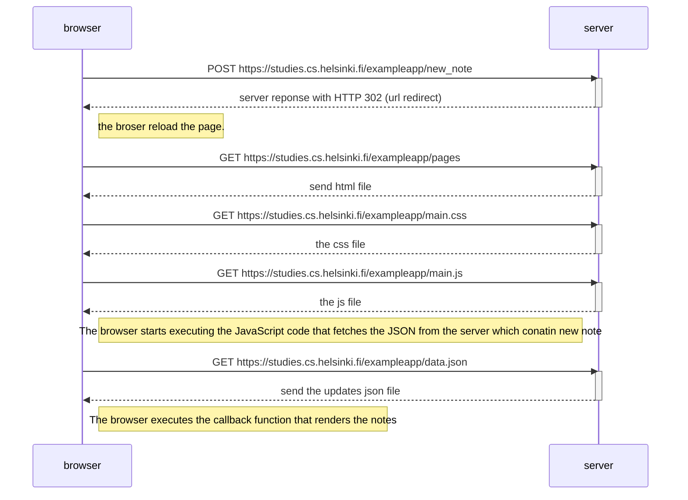

```mermaid
    sequenceDiagram
    participant browser
    participant server

    browser->>server: POST https://studies.cs.helsinki.fi/exampleapp/new_note
    activate server
    server-->>browser: server reponse with HTTP 302 (url redirect)
    deactivate server

    Note right of browser: the broser reload the page.
    browser->>server: GET https://studies.cs.helsinki.fi/exampleapp/pages
    activate server
    server-->>browser: send html file
    deactivate server

    browser->>server: GET https://studies.cs.helsinki.fi/exampleapp/main.css
    activate server
    server-->>browser: the css file
    deactivate server

    browser->>server: GET https://studies.cs.helsinki.fi/exampleapp/main.js
    activate server
    server-->>browser: the js file
    deactivate server

    Note right of browser: The browser starts executing the JavaScript code that fetches the JSON from the server which conatin new note

    browser->>server: GET https://studies.cs.helsinki.fi/exampleapp/data.json
    activate server
    server-->>browser: send the updates json file
    deactivate server

    Note right of browser: The browser executes the callback function that renders the notes
```